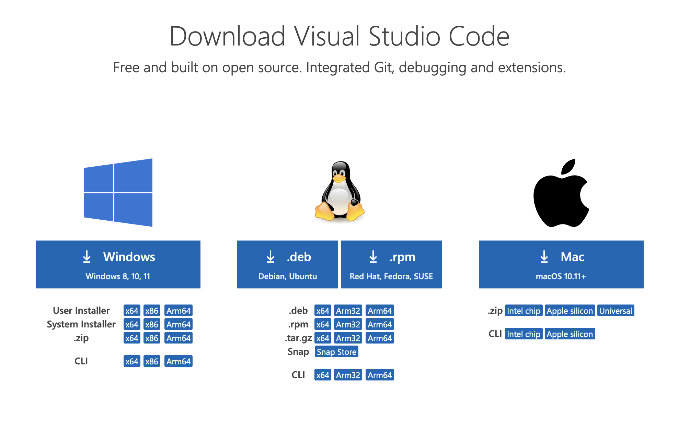

# Lab 1: An Introduction to Remote Access 

When I began the first lab of the class, I was *incredibly* unfamiliar with operating systems, terms like "bash", and why we needed to use the terminal in VSCode as opposed to using our native terminal. Before starting the listed tasks below, it's helpful to understand what exactly you are doing.

## What are operating systems?
Let's familiarize ourselves with some common terms associated with operating systems:
- [Operating system][1]: Software that manages all of the software and hardware with the ability to run multiple processes at once (multitasking). Some of its functionalities include memory allocation, communicating with hardware peripherals (devices connected to the computer), and handling I/O.
- [Shell][2]: Program that allows for the user to interact with the operating system
- [Bash][3]: A Unix shell/command language
- [SSH][4]: A network communication protocol allowing for encrypted communication between two computers (remote access)

[1]: https://www.youtube.com/watch?v=26QPDBe-NB8
[2]: https://en.wikipedia.org/wiki/Shell_(computing)
[3]: https://en.wikipedia.org/wiki/Bash_(Unix_shell)#cite_note-:0-20
[4]: https://www.ucl.ac.uk/isd/what-ssh-and-how-do-i-use-it

## Installing Visual Studio Code
VSCode's integrated terminal allows for the user to switch between different shells with ease, unlike with the native terminal. In order to install VSCode, go to https://code.visualstudio.com/download and click the download link corresponding to your respective operating system. Afterwards, you should have a .zip link which you may unzip to install the program.


*Download page for VSCode*

## Remotely connnecting
In this step, you will be getting remote access to the ieng6.ucsd.edu server running Linux. Open VSCode and its integrated terminal. Ensure that you are running bash (Linux/macOS) or git bash (Windows). To login to the server, use the following command: ```ssh [username]@ieng6.ucsd.edu``` with your course-specific username replacing [username]. You may find your username at https://sdacs.ucsd.edu/~icc/index.php. Afterwards, you'll be prompted to enter your password. Enter it as you would normally do so, but be aware of the fact that no characters will show up. Once you've entered your password, you will be asked for confirmation to continue connecting–respond by typing 'yes'. You should be met with the following screen:


*A successful connection*

Congrats! You have successfully connected to the remote server!