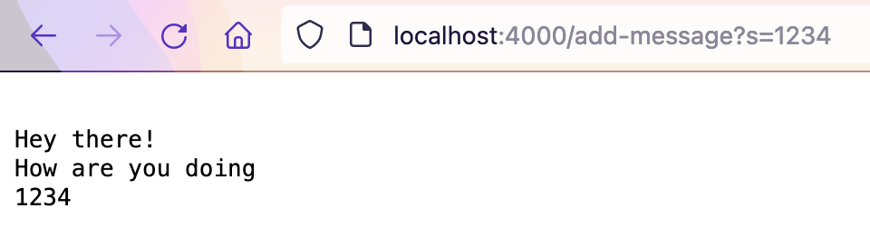

# Lab 2: Servers and Bugs

## Creating and hosting your own web server 

Today, you'll be learning how to host your own web server that responds to different queries with Java! To start, here is the code for an example server I created called StringServer that takes the query from a request and concatenates it with a string. 

```java
import java.io.IOException;
import java.net.URI;

class Handler implements URLHandler {

    String response = new String();

    public String handleRequest(URI url) {

        if (url.getPath().contains("/add-message")) {
            String[] parameters = url.getQuery().split("=");
            if (parameters[0].equals("s")) {
                response += "\n" + parameters[1];
                return response;
            }
        } 
        return "404 error :(";
    }
}

class StringServer {
    public static void main(String[] args) throws IOException {
        if(args.length == 0){
            System.out.println("Missing port number! Try any number between 1024 to 49151");
            return;
        }

        int port = Integer.parseInt(args[0]);

        Server.start(port, new Handler());
    }
}
```

Line by line, here are what each piece of code does:
- Import statements: While the IOException handles cases where the user starts the server with something other than a port number, java.net.URI provides the API for handling URLS and parsing them.
- ```String response = new String();```: Creates the string variable that stores all of the queries.
- ```public String handleRequest(URI url) {...}```: This runs in an infinite loop, listening for new requests being made (somebody accessing the server through a URL)
- Code within ```handleRequest(URI url)```: This method specifically looks at the path and query string that follows host name. To learn more about URLs, you can go [here][2]. If the path contains the string ```"/add-message"```, the second query (the value in a name and value pair, separated by a '=') is added to the ```response``` string. Lastly, the web server prints out the current string variable for the visitor.
- ```class StringServer {...}```: Using the Server class (not included), this starts up a web server with a specified port number.

[2]: https://www.ibm.com/docs/en/cics-ts/5.1?topic=concepts-components-url

How does our web server look when it's up and running? After running
```
javac *.java
java StringServer 4000
```
you can visit your web server on [http://localhost:4000](http://localhost:4000). You'll notice that you'll get a 404 error–this is because we haven't included a path in our URL! First, I'm going to add the strings "Hey there!" and "How are you doing" to our string variable.


Even though we made multiple requests, the variable stored all of the queries we entered. ```handleRequest(URI url)``` is called for both of these requests, and the URL that we typed in the search bar is passed through the method. Since we entered strings for our queries, they are not changed as they are added on to a string variable. So what happens if we enter values that aren't strings?



When we input integer value for our query, ```handleRequest(URI url)``` is called again with our URL. However, this time, the integer value is converted from an integer to a string and displayed on the page.

## Debugging

Debugging is an inevitable step of programming. However, in Java, there is a testing framework called JUnit which you can use to continuously test your code with less effort. 
