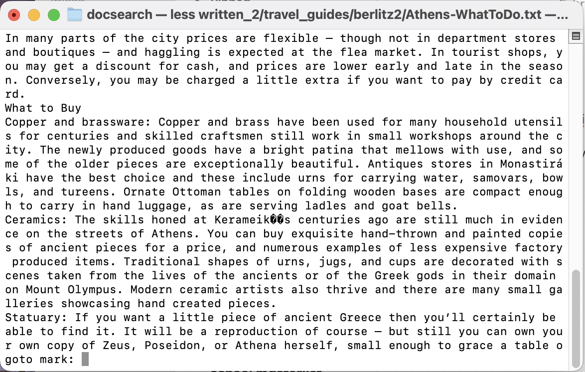
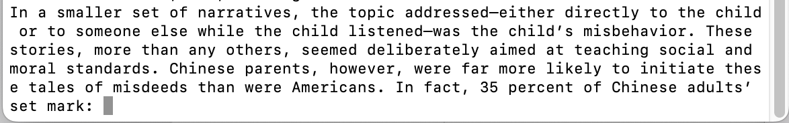
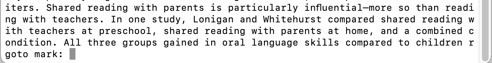
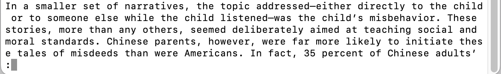
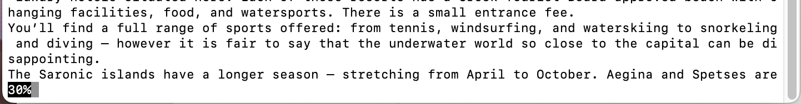
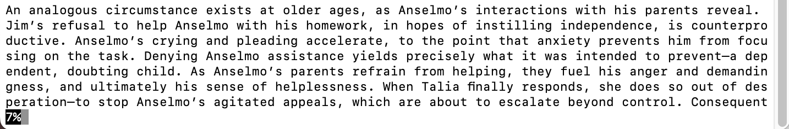
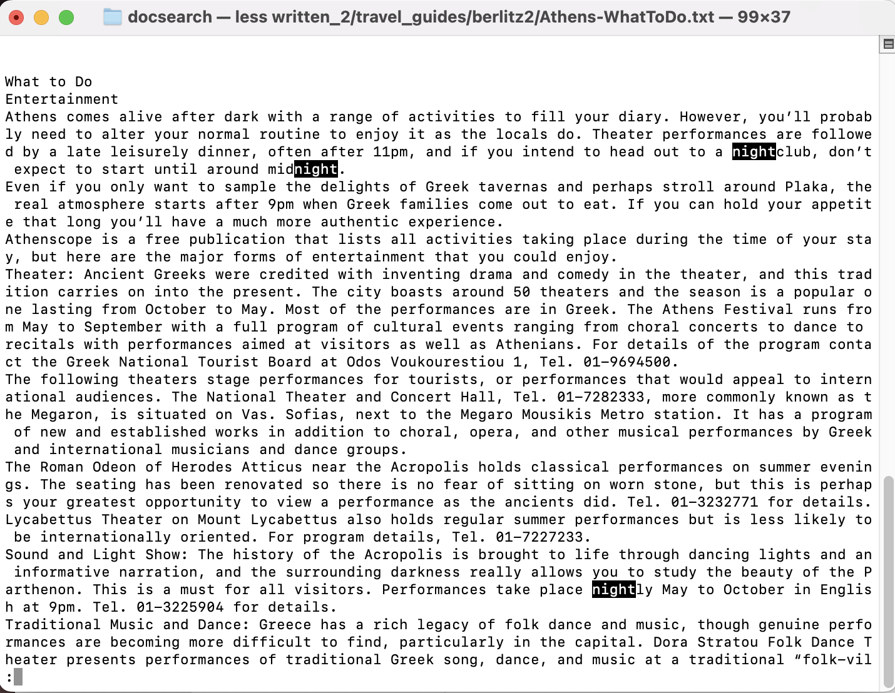
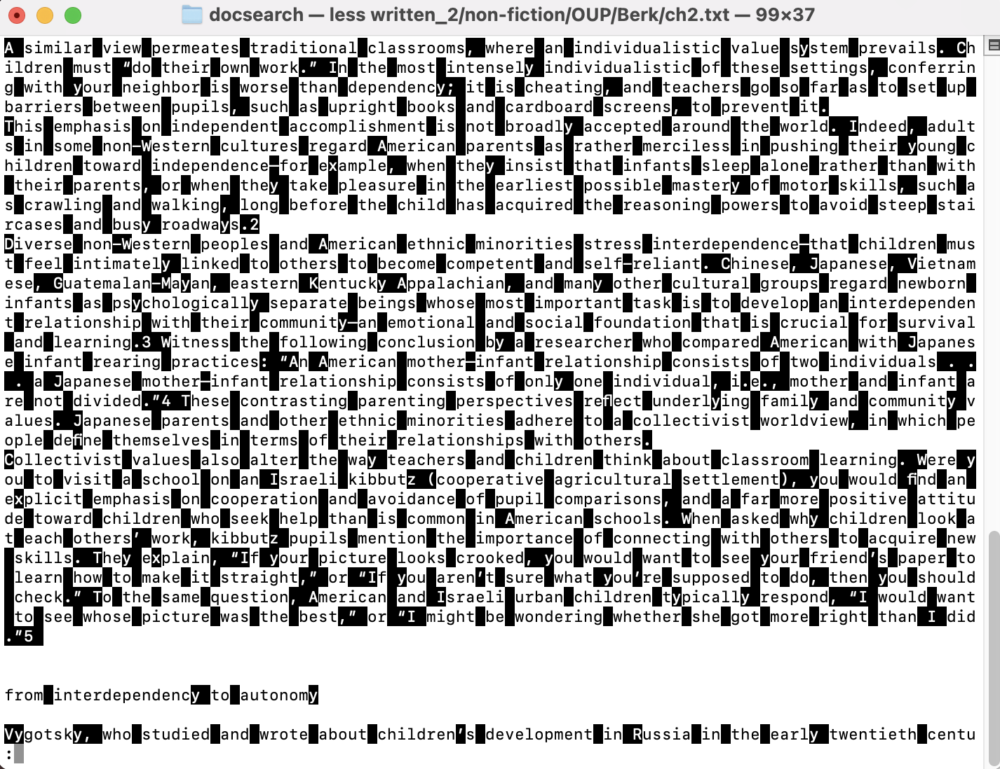
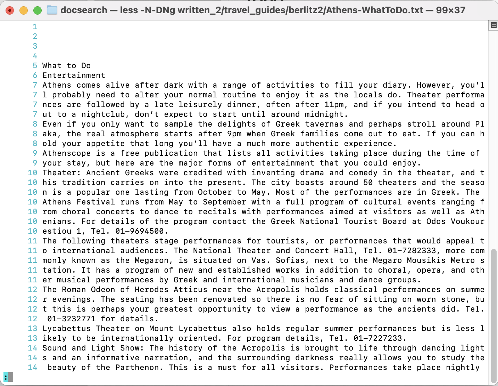
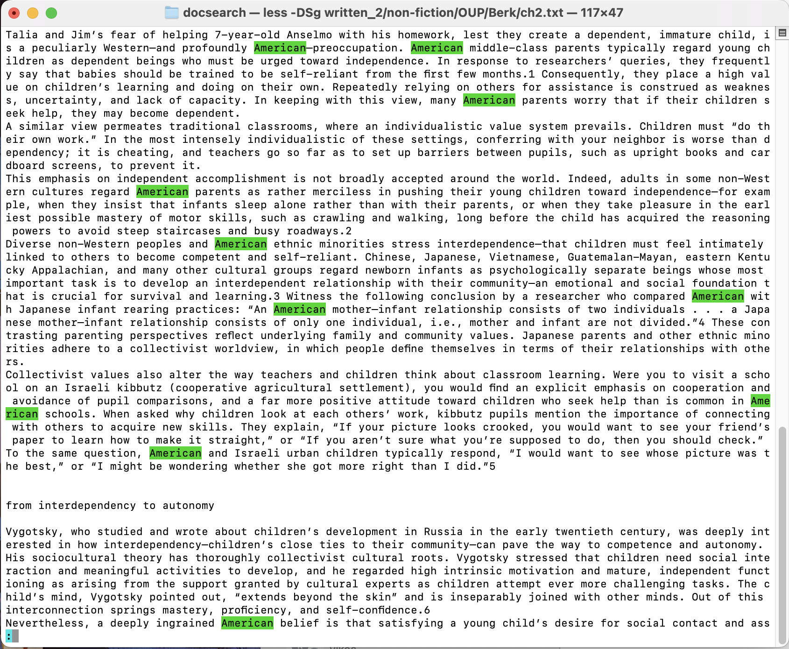

# Lab 3: Researching Commands

Terminal commands are helpful if you have a directory full of files that you need to sift through or a large file that needs to be parsed. Personally, I know too little about the command `less`, so we'll be researching some interesting ways we can use this command today.

## What is `less`?

[`less`](https://linuxize.com/post/less-command-in-linux/) allows for a user to go through the contents of a large file page by page. Both backward and forward traversal is supported. The ability for it to read the file page by page also allows for faster runtimes.

## Bookmarking with `less`

Source: [https://linuxhandbook.com/less-command/](https://linuxhandbook.com/less-command/)

When reading through a large file, it would be helpful to bookmark parts so that you can instantly return to them later. To do this, simply use the command as usual: 
```
less written_2/travel_guides/berlitz2/Athens-WhatToDo.txt
```
As expected, the first few lines of the file show up. Now, if we scroll to a random part and press `m`, we'll be greeted with this prompt:


Pressing any key sets a bookmark for this section that corresponds to said key. To return to the bookmark, press `'` and then the key that you set for the bookmark. 


*Using `'`*


*Pressing the key that corresponds to the section that we set the bookmark for*

Let's see this in play with one of the longer texts in the nonfiction directory, ch2.txt of Berk.


*Setting the bookmark with `mk`*


*Scrolling away*


*Returning back to bookmark with `'k`*

## Tracking progress with `-m`

Source: [https://linuxhandbook.com/less-command/](https://linuxhandbook.com/less-command/)

Instead of using line numbers, we can also use the `-m` option to track our progress through a text file. After using
```
less -m written_2/travel_guides/berlitz2/Athens-WhatToDo.txt
```
we're greeted with the same interface. However, instead of a colon at the bottom of the screen, we see the percentage representing how much of the file we've been through:


Trying this with another file from non-fiction, we get the same result: 
```
less -m written_2/non-fiction/OUP/Berk/ch2.txt
```


This command is especially useful if you're an avid reader and enjoy reading through entire novels on the command line interface (psycho). With `-m`, you can turn your terminal into a rudimentary e-reader!

## Searching for patterns with `/`

Source: [https://linuxhandbook.com/less-command/](https://linuxhandbook.com/less-command/)

Like `grep`, we can look for certain patterns inside a large text file. However, unlike `grep`, `less` gives us more options to view the surroundings of the found pattern. It functions very similarly to `ctrl-F` whenever you're on your browser or Google Docs. First, let's `less` into our text file as normal:
```
less written_2/travel_guides/berlitz2/Athens-WhatToDo.txt
```
After typing in 
```
/night
``` 
after the colon, any substrings matching the phrase 'night' is highlighted.



Instead of using a phrase, let's try using a regular expression pattern. After using `less` on ch2.txt of Berk, we input this search pattern:
```
/[^a-w]
```
all of the text that is NOT a character in the range a-w is highlighted.



## Showing line numbers and changing their color

Source: `man less`

Sometimes, it's nice to see where we are inside the file. We can achieve this with line numbers, enabled with `-N`. What's more, for better readability, we can change the color of line numbers with `-DNcolor` where `color` is the color we wish to use. In this case, let's use cyan, which is denoted by `c`.

Using 
```
less -N-DNc written_2/travel_guides/berlitz2/Athens-WhatToDo.txt
```
we actually receive a prompt if we'd like to enable color with --use-color. After typing this in, we're greeted with this interface:



As we can see, the line numbers are shown and colored cyan. Let's try this command with another text file, but instead of coloring line numbers, we'll try to color search results instead. This can be done by replacing the N with an S. Additionally, we'll use green by replacing the c with a g. 

```
less -DSg written_2/non-fiction/OUP/Berk/ch2.txt
```
The normal interface will pop up, but after searching
```
/American
```
we'll get these results.


