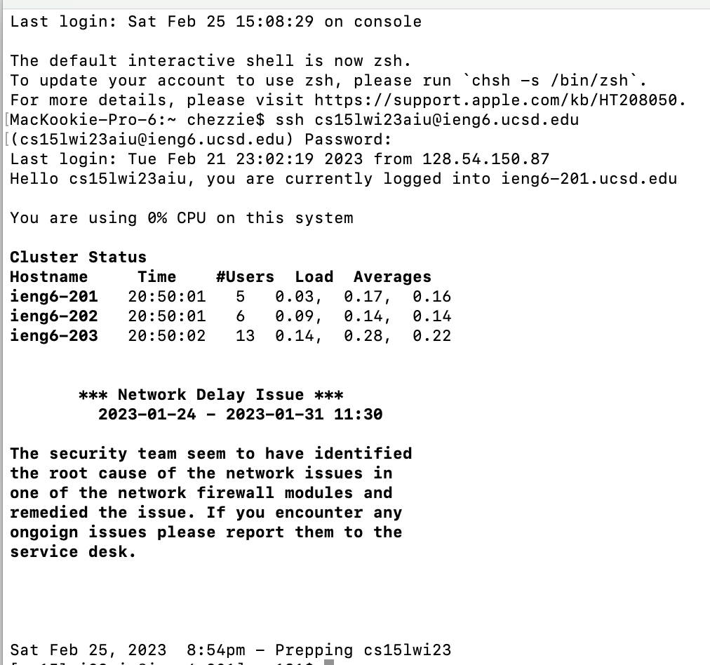
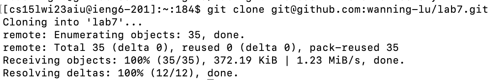
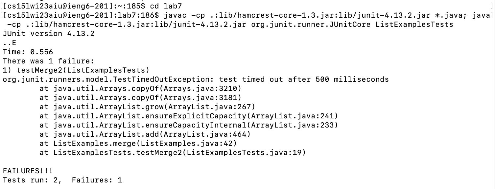
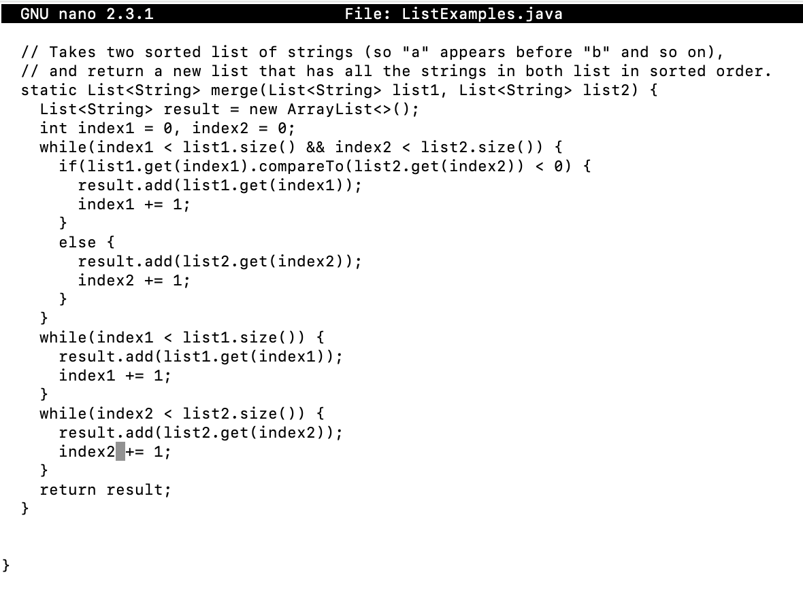
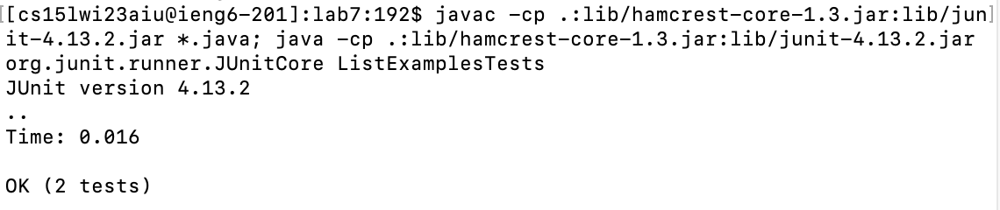
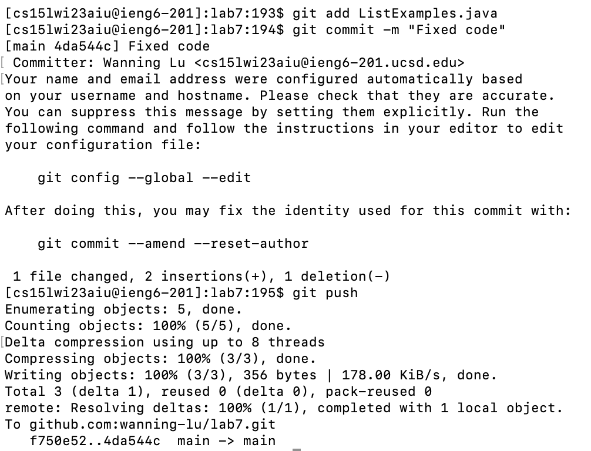

# Lab 4: Using Git from a Remote Machine

Over the course of this lab report, I'll be detailing the steps on how to edit the contents of a repository in a remote machine as well as push those changes using Git. These are the steps that we will be following:

1. Log into ieng6 (our remote machine that we will be working with)
2. Clone your fork of the repository from your Github account
3. Run the tests, demonstrating that they fail
4. Edit the code file to fix the failing test
5. Run the tests, demonstrating that they now succeed
6. Commit and push the resulting change to your Github account

For this project, we will be using [this repository](https://github.com/ucsd-cse15l-w23/lab7).

**1. Log into ieng6:**

Here, I am simply accessing the remote machine through my account via the ssh protocol.

Exact steps:

`ssh cs15lwi23aiu@ieng6.ucsd.edu<enter>` (aiu is my account specific name, yours might have a different 3 letter combination)
`[insert password here]<enter>`

**2. Clone your fork of the repository from your Github account:**

For this step, you will need to add the ssh key of your remote machine. This will allow us to push the changes we make to our repository. To do this, create an ssh key with `ssh-keygen` and then copy and paste the contents of your key, which can be accessed by doing `cat [location of .pub file]`. Lastly, you will login to your Github account and add the ssh key from your account settings. Now, you can clone the repository with its ssh key as shown:

Exact steps:

`git clone git@github.com:wanning-lu/lab7.git<enter>`

**3. Run the tests, demonstrating that they fail:**

To first run the tests, I need to go into the folder of my repository, which I do with `cd`. Afterwards, I compile and execute the tester file with JUnit, as well as `javac` and `java`.

Exact steps:

`cd lab7<enter>`

`javac -cp .:lib/hamcrest-core-1.3.jar:lib/junit-4.13.2.jar *.java; java -cp .:lib/hamcrest-core-1.3.jar:lib/junit-4.13.2.jar org.junit.runner.JUnitCore ListExamplesTests<enter>` (Here, I combined two commands by using the separator `;`, allowing me to simultaneously compile and run the test file)

**4. Edit the code file to fix the failing test:**

First, I use `nano` in order to access and edit the java file. The problem lies in line 43, where the wrong index number is listed, causing an infinite loop to run. I fix this by replacing the 1 with a 2, and then exiting and saving the file.

Exact steps:

`nano ListExamples.java<enter>`

`<down>`x42`<right>`x12`<backspace><2><CTRL+X><y><enter>`

**5. Run the tests, demonstrating that they now succeed:**

Now, I can run my tests again by going into my history and running the same command.

Exact steps:

`<up><up><enter>`

**6. Commit and push the resulting change to your Github account:**

Lastly, I need to commit these changes and push them to my repository on Github. To do so, I first add (stage) the changes by using `git add` on the file. Then, I need to commit the changes to officially create a new 'version' of my project with `git commit`. Lastly, I use `git push` in order to finalize the changes and have them reflect on my Github repository. Because we used the ssh key to clone, we are allowed to push changes.

Exact steps:

`git add ListExamples.java<enter>`

`git commit -m "Fixed code"<enter>`

`git push<enter>`
