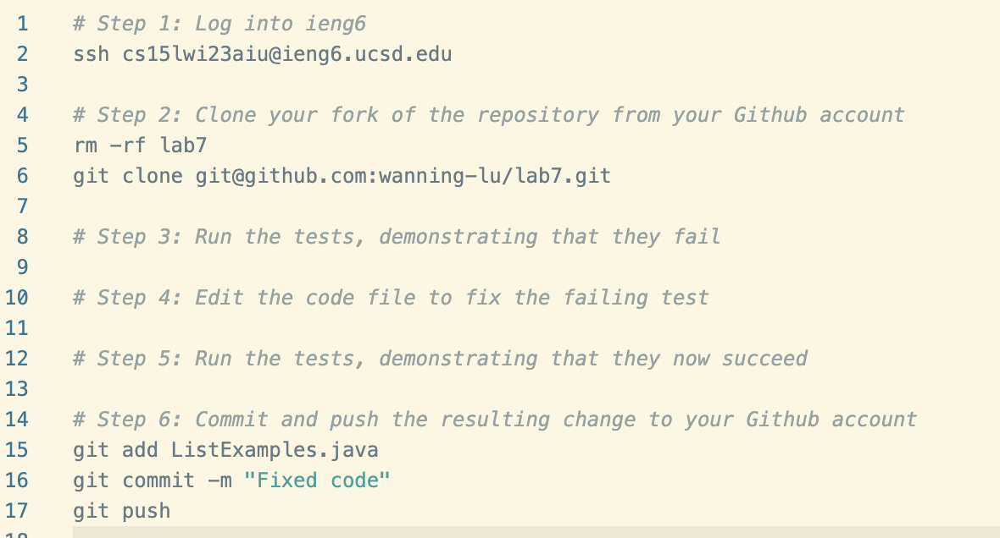
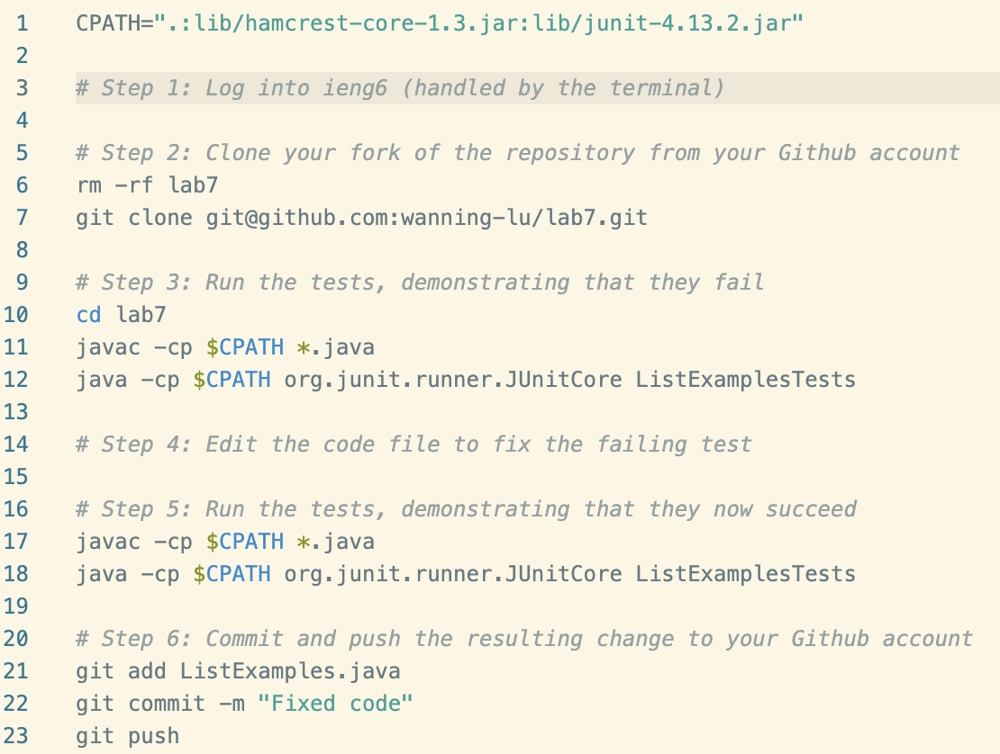
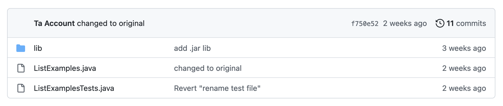
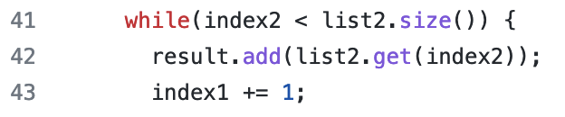
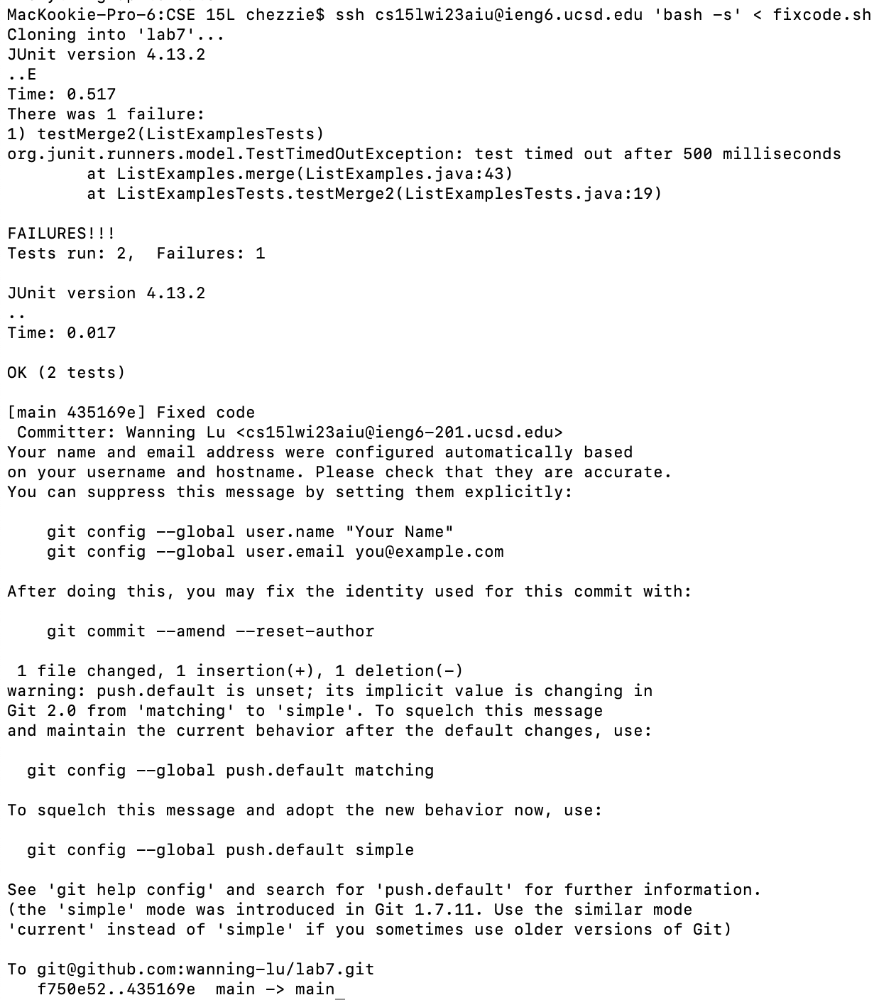
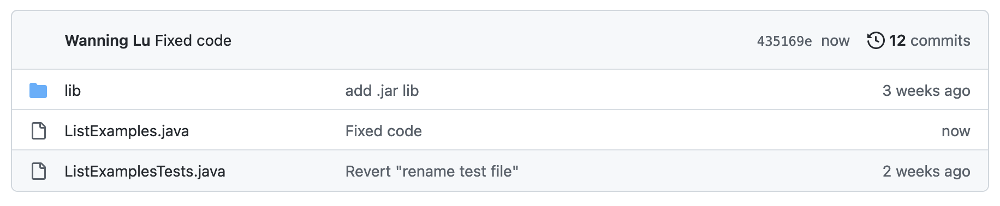
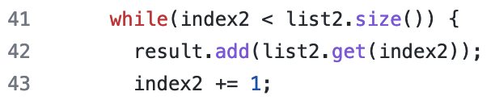

# Lab 5: Performing Lab 4, but more efficiently with a bash script

Today we'll be reviewing the challenge from Lab 4, which was using Git from a remote machine. However, let's see if we can make the process more efficient by using a bash script; this way, instead of typing multiple commands, we only have to type one. 

Let's review the steps:
1. Log into ieng6 (our remote machine that we will be working with)
2. Clone your fork of the repository from your Github account
3. Run the tests, demonstrating that they fail
4. Edit the code file to fix the failing test
5. Run the tests, demonstrating that they now succeed
6. Commit and push the resulting change to your Github account

Additionally, let's review the commands from Lab 4 that corresponded with each step: 
1. `ssh cs15lwi23aiu@ieng6.ucsd.edu<enter>` (note: since we generated an ssh key for ieng6 on our local computer, there is no need to go through the password authentication stage)
2. `git clone git@github.com:wanning-lu/lab7.git<enter>`
3. `cd lab7<enter>javac -cp .:lib/hamcrest-core-1.3.jar:lib/junit-4.13.2.jar *.java; java -cp .:lib/hamcrest-core-1.3.jar:lib/junit-4.13.2.jar org.junit.runner.JUnitCore ListExamplesTests<enter>`
4. `nano ListExamples.java<enter><down>`x42`<right>`x12`<backspace><2><CTRL+X><y><enter>`
5. `<up><up><enter>`
6. `git add ListExamples.java<enter>git commit -m "Fixed code"<enter>git push<enter>`

It seems that for steps 1, 2, and 6, translating them into a bash script is relatively simple. All we have to do is copy paste the commands into our bash script, which we will name "fixcode.sh". Because we will be testing this multiple times, it's helpful to include a `rm -rf lab7` command so that we can start on a fresh slate every time. This is what our bash script should look like so far: 

However, we run into an issue. After executing the bash script, it seems as though the script stops running; none of the other commands are executed. Upon exiting the script, however, it runs as normal. One way to bypass this is by executing the login command in the terminal and feeding the bash script into it:

`ssh cs15lwi23aiu@ieng6.ucsd.edu 'bash -s' < fixcode.sh`

`bash -s` tells bash to parse commands from the input stream, which in this case, is our script. You might notice that none of the login prompts show up when we execute this bash script, but your terminal will still show that you are on the remote machine.

Steps 3 and 5 are almost identical; they both involve compiling and executing the tester file. However, to make our bash script more readable, we can store the path of the JUnit and Hamcrest jar files in a variable called CPATH. Afterwards, we can copy paste the commands in, substituting the class paths with the variable name. Now, our script should look like so:

Now for the difficult part: fixing the error in the code file without using `nano`. Instead, we can use [sed](https://www.gnu.org/software/sed/manual/sed.html), which, from GNU, is a "stream editor. A stream editor is used to perform basic text transformations on an input stream (a file or input from a pipeline)." With this, we don't have to go into the file itself to make the change. We will use this command:

`sed -i '43 s/index1/index2/' ListExamples.java`

Dissecting this command piece by piece:

`-i` tells the system to edit files in-place instead of printing to the standard output. This modifies the file itself.

`'43 s/index1/index2/'` describes the way in which we want to edit our text file: `43 s` tells `sed` to edit the text on the 43rd line, which is where our error is. `index1` is the text to replace, and `index2` is the text that replaces it. 

`ListExamples.java` is the file that contains the error.

This will be our completed bash script:
[Complete script](images/lab5-3.png)

Here are the results after running it:

**BEFORE**

*Before the commit*

**AFTER**

*After the commit*

Now, we've successfully consolidated a whole line of commands into one simple bash script!

